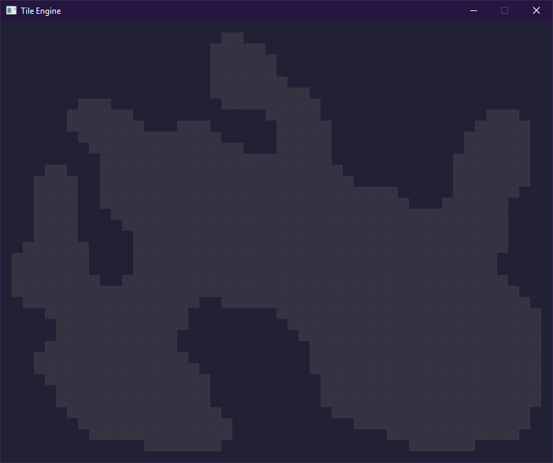

# TileEngine
An experimental tile engine for testing procedural content generation algorithms such as cellular automaton.

<h1>Instructions</h1>

```
1. Download SDL2 and SDL2_image
2. Link the lib and dll files to project
```

<h1>Examples</h1>



